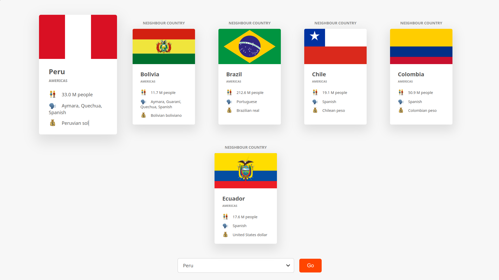

# Countries Getter 🌍


a clean, modern web app that allows you to explore information about countries around the world.



## ✨ Features

- **Country Selection**: Choose a country from a dropdown list to see its details.
- **Detailed Information**: View key data for each country, including its flag, region, population, languages, and currencies.
- **Neighboring Countries**: See the bordering countries for any selected nation.
- **Data from a Live API**: Fetches up-to-date information from the [REST Countries API](https://restcountries.com/).

## 🛠️ Built With

- Vanilla JavaScript
- HTML & CSS
- [REST Countries API](https://restcountries.com/) - A free API providing comprehensive country data.
- [Cloudflare Workers](https://www.cloudflare.com/developer-platform/products/workers/) - For serverless deployment.

## 🚀 Getting Started

```sh
git clone https://github.com/luiisca/Countries-getter.git
cd Countries-getter
npm install
npm run dev
```

This will start a development server, and you can view the application in your browser at the local address provided in the terminal.

## 🌐 Demo

https://countries-getter.luiisca.workers.dev
